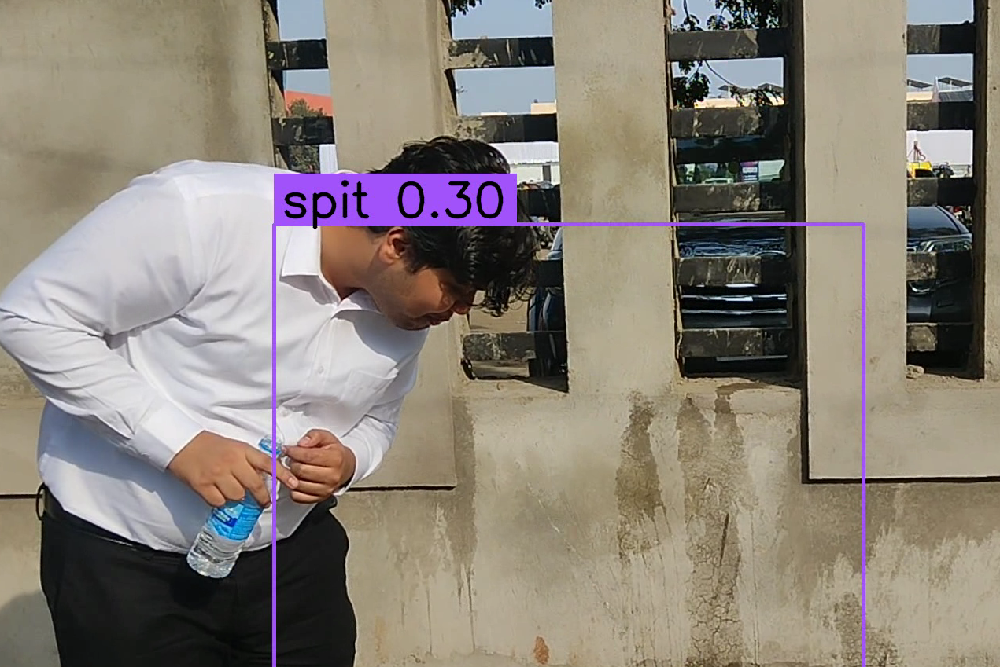

# SpitCheck - YOLOv8 Based Spit Detection System

## Project Overview

SpitCheck is an innovative project proposed for the Nagpur Metro at Compex 2024, organized by VCMDWA (Vidarbha computer & media dealers wellfare association) in association with Nagpur Police, Nagpur Metro, and MSME. SpitCheck utilizes the YOLOv8 model to detect instances of spitting within the metro premises. The system not only identifies the person involved but also takes immediate action by making their metro ticket invalid.

## How SpitCheck Works

### Step 1: Face Data Encoding

1. SpitCheck starts by saving the customer's face data in the QR code of the metro ticket during the ticket issuance process.

### Step 2: Real-time Spit Detection

1. Within the metro premises, SpitCheck continuously monitors the surroundings in real-time using the YOLOv8 model.
2. If a person is detected spitting, the system immediately identifies their face using the encoded data in the QR code.

### Step 3: Ticket Invalidation

1. Upon successful identification of the person spitting, SpitCheck takes swift action by invalidating their metro ticket.
2. The person is then notified about the violation, and appropriate measures can be taken by the metro authorities.

## Project Recognition

SpitCheck was shortlisted for the finals at Compex 2024, showcasing its effectiveness in addressing hygiene and cleanliness concerns within metro stations.

## Sample Prediction Image




## Dependencies

- YOLOv8: The project is built on the YOLOv8 model for real-time object detection.
- OpenCV: Utilized for image processing and interfacing with the YOLOv8 model.
- QR Code Library: Used for encoding and decoding facial data into the metro ticket's QR code.

## Usage

To use SpitCheck, follow these steps:

1. Install the required dependencies.
2. Deploy the YOLOv8 model for real-time spit detection.
3. Integrate SpitCheck with the metro ticketing system for face data encoding.

```bash
# Example commands for installation and deployment
cd backend
pip install -r requirements.txt
flask run app.py
cd compex
npm i
npm run dev
